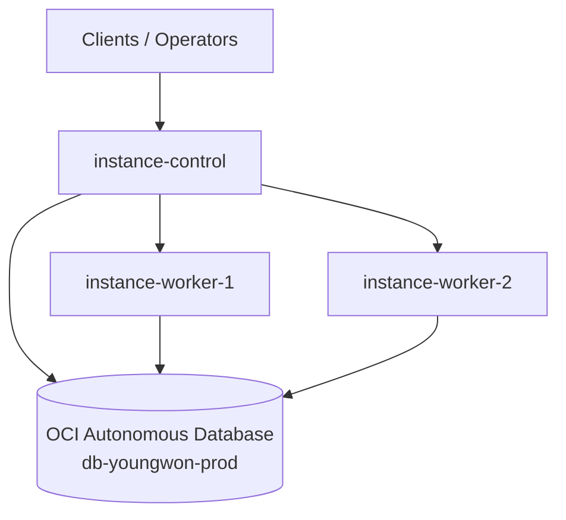

# Terraform OCI Infrastructure

This repository manages the current OCI infrastructure with local Terraform.

## High-Level Architecture

This repository defines infrastructure, not application code. Based on the currently managed resources, the server-side shape can be understood at a high level as:



Infrastructure roles:

- `instance-control`: control or entry node for server-side operations
- `instance-worker-1`, `instance-worker-2`: worker nodes for application or batch workloads
- `db-youngwon-prod`: persistent shared database

This is an infrastructure-oriented view only. Exact application processes, ports, runtime behavior, and request flow are not defined by this repository alone.

Managed resources:
- 1 Autonomous Database
- 3 Compute instances
  - `instance-control`
  - `instance-worker-1`
  - `instance-worker-2`

The previous OCI Stack is no longer the source of truth. This repository and its Terraform state are the active management path.

## Repository Structure

- `providers.tf`: OCI provider definition
- `variables.tf`: variables loaded through `TF_VAR_*`
- `database.tf`: Autonomous Database resource
- `instances.tf`: Compute instance resources
- `.env.example`: example local environment file
- `.env`: local-only environment file, not committed

## Prerequisites

1. Terraform CLI installed
   - Recommended: Terraform `1.14.x`
2. OCI API authentication configured on the machine
   - This repository currently relies on the default OCI config lookup
   - Expected location: `~/.oci/config`
   - If needed, generate it with `oci setup config`

Example OCI config:

```ini
[DEFAULT]
user=ocid1.user.oc1.....
fingerprint=xx:xx:xx:xx:xx:xx:xx:xx:xx:xx:xx:xx:xx:xx:xx:xx
tenancy=ocid1.tenancy.oc1.....
region=ap-chuncheon-1
key_file=/path/to/oci_api_key.pem
```

## Local Setup

Create the local env file from the example:

```bash
cp .env.example .env
```

Fill in the actual values in `.env`, then load it:

```bash
source .env
```

The repository expects these variables:

- `TF_VAR_compartment_id`
- `TF_VAR_db_admin_password`
- `TF_VAR_db_customer_contact_email`
- `TF_VAR_db_whitelisted_ips`
- `TF_VAR_instance_ssh_authorized_keys`
- `TF_VAR_oracle_tags_created_by`

### Environment Variables

This repository uses Terraform input variables through shell environment variables.

Important behavior:

- `.env` is only a shell script file containing `export ...` lines
- Terraform does not load `.env` automatically
- You must run `source .env` in the current shell before `terraform plan` or `terraform apply`
- `.env.example` is a template only and should not contain real values

Example:

```bash
source .env
terraform plan
```

For complex values, keep the shell format valid. In particular, `TF_VAR_db_whitelisted_ips` must stay a list string:

```bash
export TF_VAR_db_whitelisted_ips='["203.0.113.10","203.0.113.11"]'
```

Also note that OCI provider authentication is separate from these variables. This repository currently gets OCI credentials from `~/.oci/config`, while the `TF_VAR_*` values are used only for Terraform-managed resource inputs.

## Usage

Initialize once:

```bash
terraform init
```

Check planned changes:

```bash
source .env
terraform plan
```

Apply changes:

```bash
source .env
terraform apply
```

## Security Notes

- Do not commit `.env`
- Do not commit OCI private keys
- Do not hardcode passwords, emails, SSH keys, or environment-specific IPs in `*.tf`
- `.env.example` is for structure only and must not contain real secrets

## State Management

This repository currently uses local state:

- `terraform.tfstate`
- `terraform.tfstate.backup`

That is acceptable for single-user local management, but not a strong long-term setup for shared operations. If multiple people or CI will manage this infrastructure, move state to a remote backend before expanding usage.

## Operating Rule

Use this repository as the single Terraform management path for these OCI resources. Avoid managing the same resources again from another OCI Stack or separate Terraform state.
